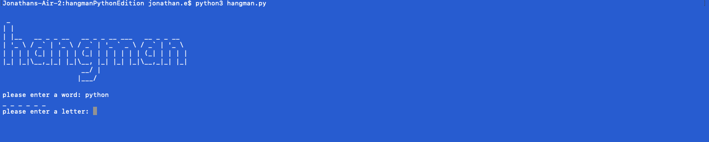
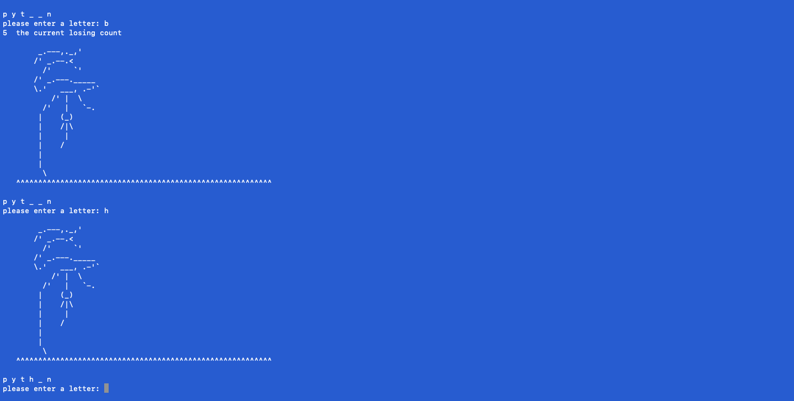
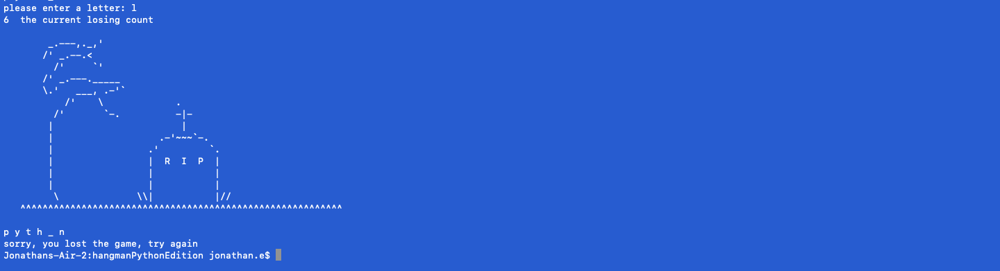

# Python 3 Hangman :heart:

### A small project to test my new python skills to the test. My main language is JavaScript, and i took the challenge to learn python3 for fun. 
___
### Game is using ascii art to immerse the player. Game works by having someone input a word, and the second player will have six tries to guess the word. 

# Screenshots

___

___

___

## Made with :heart:
### Jonathan